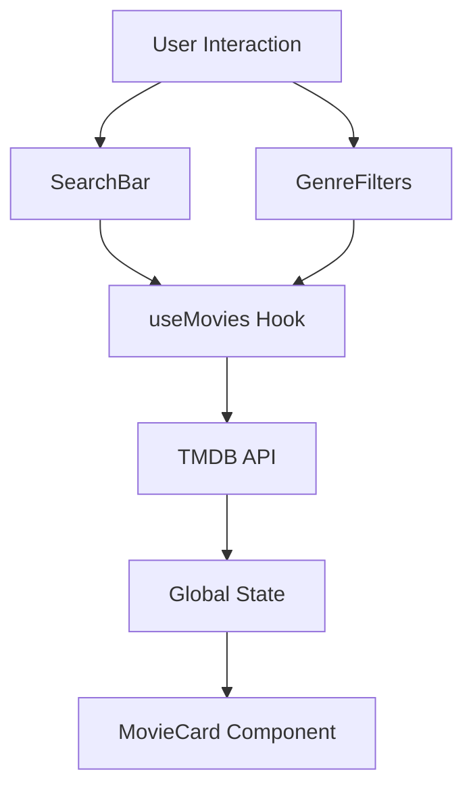

<div align="center">

# 🎬 CineMaster

**Advanced Movie Explorer & Tracker**

[🚀 Demo](#) - [🐛 Issues](https://github.com/n3brrr/CineMaster/issues) - [📖 Docs](#documentation)

</div>

---

## ⚡ Overview

CineMaster is a modern web application designed to seamlessly explore and discover movies. Built with a robust React & TypeScript architecture, it features real-time movie search, genre filtering, and a sleek, responsive interface powered by TailwindCSS.

### ✨ Key Features

- 🔍 **Smart Movie Search** - Instant access to a vast database of movies via TMDB API
- 🎭 **Genre Filtering** - Intuitive category filtering to find exactly what you're looking for
- ⚡ **High Performance** - Powered by Vite for lightning-fast builds and HMR
- 🎨 **Modern Design** - Fully responsive UI with TailwindCSS v4
- 🛡️ **Type Safety** - Comprehensive TypeScript integration for reliability

### 🛠️ Tech Stack

<p align="left">


</p>

---

## 📦 Installation

### Prerequisites

- Node.js 18+ (Recommended)
- npm or pnpm

### Quick Setup

```bash
# Clone repository
git clone https://github.com/n3brrr/CineMaster.git

# Navigate to directory
cd CineMaster

# Install dependencies
npm install

# Start Development Server
npm run dev

# Build for Production
npm run build
```

## 📁 Project Structure

```bash
CineMaster/
├── src/
│   ├── components/      # UI Components (MovieCard, SearchBar, GenreFilters)
│   ├── hooks/          # Custom hooks (useMovies)
│   ├── assets/         # Static assets
│   ├── App.tsx         # Main application component
│   └── main.tsx        # Entry point
├── public/             # Public assets
├── index.html          # Entry HTML
├── vite.config.ts      # Vite configuration
└── package.json        # Dependencies and scripts
```

## 🔄 Architecture



## 💻 Usage

```typescript
// Example: Using the custom hook for movie fetching
import useMovies from './hooks/useMovies';

const MyComponent = () => {
  const { movies, loading, getMovies, getMoviesByGenre } = useMovies();

  return (
    <div className="p-4">
      <button onClick={() => getMovies('Inception')}>
        Search "Inception"
      </button>

      <div className="grid gap-4">
        {movies.map(movie => (
          <div key={movie.id}>{movie.title}</div>
        ))}
      </div>
    </div>
  );
};
```

## 🧪 Scripts

```bash
# Start development server
npm run dev

# Build for production
npm run build

# Lint code
npm run lint

# Preview production build
npm run preview
```

## 👤 Author

**Rubén Torres** - [@n3brrr](https://github.com/n3brrr)

Frontend Developer | TypeScript Enthusiast

<div align="center">
⭐ Star this repo if you find it useful
</div>
